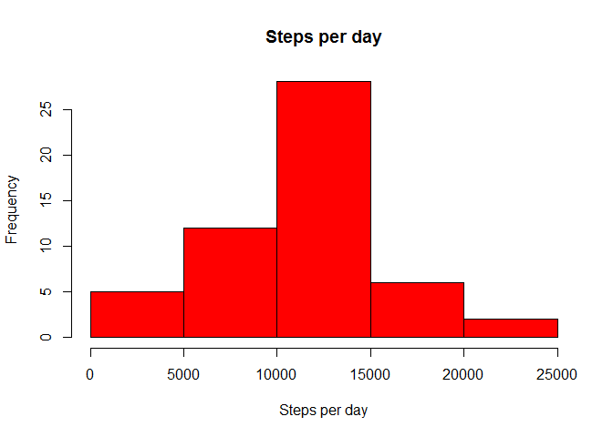
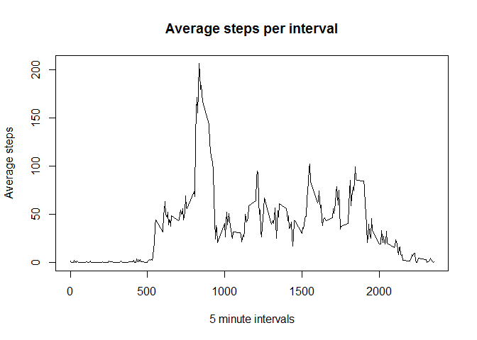
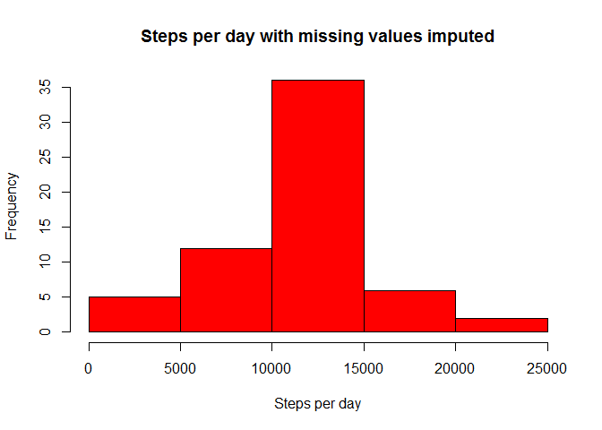
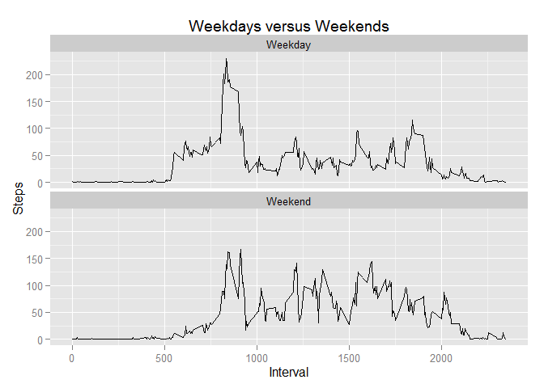

# Reproducible Research: Peer Assessment 1


## Loading and preprocessing the data
The first thing is to clear the environment so the research is really reproducible:

```r
rm(list = ls())
```
Then we load the data to a *data.frame* called *d*. The *activity.csv* is to be located under *repdata-data-activity* directory. While downloading on various systems may change this directory name so we use a pattern to retrieve the real file name. 

```r
flist <- dir(path = ".", pattern = "^repdata.data.activity$",
             ignore.case = TRUE, include.dirs = TRUE)
workDir <- flist[ 1 ]
inputFile <- paste(workDir, "activity.csv", sep = "/");
d <- read.csv(inputFile)
```
The next step is to convert the *date* column to the *Date* R type:

```r
d$date <- as.Date(strptime(d$date, "%Y-%m-%d"))
```

## What is mean total number of steps taken per day?

### Calculate the total number of steps taken per day
The total number of steps per day will be summarized into *stepsPerDay* *data.frame*:

```r
stepsPerDay <- aggregate(data = d, d$steps ~ d$date, FUN="sum")
names(stepsPerDay) <- c("date", "steps")
```

### Histogram of the total number of steps taken each day

```r
hist(stepsPerDay$steps, 
     main = "Steps per day",
     xlab = "Steps per day",
     col = "red")
```

 

### The mean and median of the total number of steps taken per day

```r
meanStepsPerDay <- mean(as.vector(stepsPerDay$steps), na.rm = TRUE)
medianStepsPerDay <- median(as.vector(stepsPerDay$steps), na.rm = TRUE)
print(paste("The mean of the total number of steps taken per day:", meanStepsPerDay))
```

```
## [1] "The mean of the total number of steps taken per day: 10766.1886792453"
```

```r
print(paste("The median of the total number of steps taken per day:", medianStepsPerDay))
```

```
## [1] "The median of the total number of steps taken per day: 10765"
```

```r
rm(stepsPerDay)
```

## What is the average daily activity pattern?

### The average number of steps taken, averaged across all days per 5 minute interval.
*stepsPerInterval* is used to aggregate the data for the plot:

```r
stepsPerInterval <- aggregate(data = d, d$steps ~ d$interval, FUN="mean")
names(stepsPerInterval) <- c("interval", "steps")
```
Then we create the plot:

```r
plot(x = stepsPerInterval$interval,
     y = stepsPerInterval$steps,
     type = "l",
     main = "Average steps per interval",
     xlab = "5 minute intervals",
     ylab = "Average steps",
     col = "black")
```

 

### The 5-minute interval, on average across all the days in the dataset, contains the maximum number of steps

```r
v <- as.vector(stepsPerInterval$steps)
print(paste("The max steps interval:", which.max(v)))
```

```
## [1] "The max steps interval: 104"
```
## Imputing missing values

### The total number of missing values in the dataset

```r
naD <- d[ is.na(d$steps) | is.na(d$date) | is.na(d$interval), ]
print(paste("The total number of rows with missing values:", nrow(naD)))
```

```
## [1] "The total number of rows with missing values: 2304"
```
### A new dataset that is equal to the original dataset but with the missing data filled in
We replace the missing values in a given 5 minute interval with the average steps for this interval in the entire data set.

```r
d1 <- d
for(idx in 1:nrow(d1))
{
    if(is.na(d1[ idx, 1 ]))
    {
        interv <- d1[ idx, 3 ]
        steps <- stepsPerInterval[ stepsPerInterval$interval == interv, 2 ]
        d1[ idx, 1] <- steps
    }
}
```

### Histogram of the total number of steps taken each day for the new data set

```r
stepsPerDay <- aggregate(data = d1, d1$steps ~ d1$date, FUN="sum")
names(stepsPerDay) <- c("date", "steps")

hist(stepsPerDay$steps, 
     main = "Steps per day with missing values imputed",
     xlab = "Steps per day",
     col = "red")
```

 

### The mean and median of the total number of steps taken per day for the new data set with imputed missing values

```r
meanStepsPerDay <- mean(as.vector(stepsPerDay$steps), na.rm = FALSE)
medianStepsPerDay <- median(as.vector(stepsPerDay$steps), na.rm = FALSE)
print(paste("The mean of the total number of steps taken per day:", meanStepsPerDay))
```

```
## [1] "The mean of the total number of steps taken per day: 10766.1886792453"
```

```r
print(paste("The median of the total number of steps taken per day:", medianStepsPerDay))
```

```
## [1] "The median of the total number of steps taken per day: 10766.1886792453"
```

```r
rm(stepsPerDay)
```
There is slight difference between the results generated from the original data and the data with imputed missing values. The difference will depend on the way the missing values are replaced.

## Are there differences in activity patterns between weekdays and weekends?

### A new factor variable in the dataset with two levels - "weekday" and "weekend"

```r
wDay <- "Weekday"
wEnd <- "Weekend"
wdays <- c()
for(dname in weekdays(d1$date))
{
    wdays <- c(wdays,
    switch(dname,
           "Monday"    = wDay,
           "Tuesday"   = wDay,
           "Wednesday" = wDay,
           "Thursday"  = wDay,
           "Friday"    = wDay,
           "Saturday"  = wEnd,
           "Sunday"    = wEnd))
}
d2 <- cbind(d1, as.factor(wdays))
names(d2) <- c("steps", "date", "interval", "wday")
```

### The weekdays versus weekends plot
*wdatAvg* *data.frame* is used to aggregate the data for the plot:

```r
wdayAvg <- aggregate(data = d2,
                            d2$steps ~ d2$wday + d2$interval,
                            FUN="mean")
names(wdayAvg) <- c("wday", "interval", "steps")

library(ggplot2)

g <- ggplot(wdayAvg, aes(interval, steps))
p <- g + geom_line() +
    facet_wrap(~ wday, nrow = 2) + 
    labs(x = "Interval") +
    labs(y = "Steps") +
    labs(title = "Weekdays versus Weekends")      
print(p)
```

 
